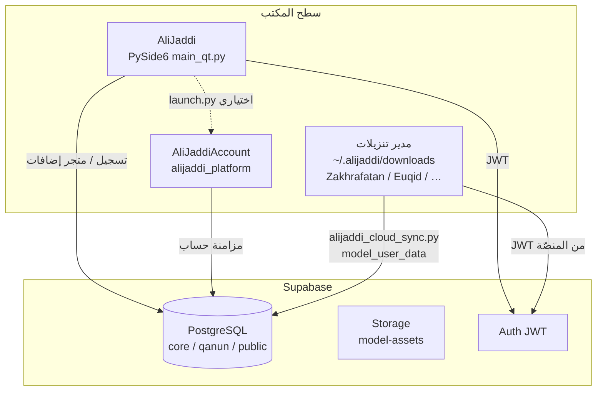
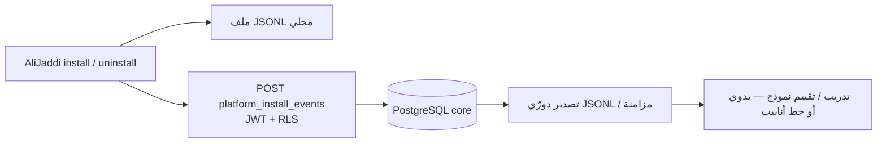

# معمارية منصّة علي جدّي (Beta 0.4.1)

توثيق يربط **المنصّة الرئيسية**، **السحابة**، **حساب المستخدم**، ومشاريع **النماذج** على سطح المكتب.

## مخطط تدفّق عالٍ

## المكوّنات والمسارات

| جزء | المجلد / الملف | الدور |
|-----|-----------------|--------|
| المنصّة | `AliJaddi/` — `main_qt.py`, `ui/`, `services/` | واجهة Qt، متجر النماذج، `addon_manager`، مصادقة |
| السحابة | `AliJaddi Cloud/` — `python/integration/` | أدوات مساعدة، ضغط، REST؛ الهجرات في `AliJaddi/supabase/migrations/` |
| الحساب | `AliJaddiAccount/` — `alijaddi_platform/desktop/launcher.py` | يُستدعى من `AliJaddi/launch.py` عند التشغيل بدون وسيطات |
| نموذج مُدار من المنصّة | `~/.alijaddi/downloads/<Model>/` (+ توافق مع مسار سطح المكتب القديم) | رفع/جلب `payload` عبر `rest/v1/model_user_data` |

## متغيرات بيئة مشتركة

- `SUPABASE_URL`, `SUPABASE_ANON_KEY` — نفس المشروع لجميع العملاء (انظر `.env.example`).
- JWT المستخدم يُمرَّر أحياناً كـ `ALIJADDI_JWT` من المنصّة عند تشغيل نموذج خارجي.
- `ALIJADDI_APPS_ROOT` — اختياري: يستبدل جذر مدير التنزيلات الافتراضي (`~/.alijaddi/downloads`) لمجلدات تطبيقات المتجر.

## بناء التوزيع (Windows)

- **المعيار الرسمي (مثل Blender):** `AliJaddi-Beta-0.4.1-Setup.exe` — مثبّت Inno (`AliJaddi_Setup.iss`): Program Files، قائمة ابدأ، تسجيل إزالة في «التطبيقات». يُبنى تلقائياً مع `scripts/build_windows_release.ps1` ويتطلب **Inno Setup 6** على جهاز البناء؛ للتخطي مؤقتاً: `ALIJADDI_SKIP_INNO=1` (ZIP فقط — ليس القناة الرئيسية).
- **مكمّل:** `تنزيل/windows/AliJaddi-Beta-0.4.1-Windows.zip` والمجلد المفكوك — نسخة محمولة دون مثبّت.
- `scripts/build_windows_release.ps1` — PyInstaller + ZIP + Inno بالترتيب.

## رؤية المنصّة (متجر + تشغيل + Ali12 للتثبيت)

**متجر علي جدّي** يعرض الكتالوج، الإصدارات، والتحديثات بعد مزامنة `registry.json`؛ **لا يُنزَّل ولا يُثبَّت** النموذج من داخل واجهة Qt. علي جدّي **مدير تنزيلات وتشغيل**: التثبيت والتحديث والإزالة عبر **Ali12** — `scripts/ali12_store_install.py` (معيار `store_consent_v2`، الافتراضي `~/.alijaddi/downloads`). المنصّة تشغّل التطبيقات **المثبّتة مسبقاً** وتعرض لوحة التشغيل.

**Ali12** يفسّر أخطاء التثبيت والتشغيل (قواعد + إشارات + `training/Ali12_seed.jsonl`) ويُكمّل مسار CLI أعلاه.

## Android (تنزيل)

- مجلد **`تنزيل/android/`** مخصص لملفات APK/AAB عند توفر بناء جوّال؛ انسخ الحزمة يدوياً أو استخدم `scripts/export_android_to_tanzeel.ps1`. لا يوجد حالياً مشروع Gradle مدمج في هذا المستودع.

| المرحلة | المضمون | الحالة |
|--------|---------|--------|
| **1 — معرض ومتجر** | `ui/main_window` + `addon_manager` + سجل GitHub/Supabase | قائم |
| **2 — تثبيت نظيف** | ZIP آمن، تتبع إصدارات، إزالة من القرص + السجل | قائم عبر `scripts/ali12_store_install.py` (خارج واجهة المتجر) |
| **3 — حزم قابلة للتوزيع** | **سطح المكتب:** PyInstaller / Inno Setup (موجود في مسار البناء). **جوال:** PWA أو غلاف (Capacitor/Flutter) لاحقاً لعرض واجهات Streamlit/Web. | مخطط / جزء سطح المكتب جاهز للبناء |
| **4 — ملاحظات أعطال موحّدة** | جدول `core.platform_install_events` + `services/install_telemetry` (سجل محلي `~/.alijaddi/telemetry_install_events.jsonl` + إرسال بـ JWT عند تسجيل الدخول) | **مضاف كبنية أولية** — تطبّق الهجرة على Supabase |
| **5 — ذكاء اصطناعي للمساعدة** | تجميع الأحداث (ومع الوقت: تعليم بشري للـ «سبب/الحل») → تصدير JSONL → تدريب نموذج تصنيف/اقتراح أو RAG على وثائق الدعم | **ليس تلقائياً بعد**؛ البيانات والهيكل يمهّدان لذلك |

### تدفّق بيانات التثبيت (للتحليل وللتدريب لاحقاً)

**خصوصية:** لا تُخزَّن كلمات المرور أو JWT في `detail`؛ يُقتطع النص ويُفضَّل رموز أخطاء ثابتة مع الوقت.

### Ali12 — نموذج IA لتثبيت التطبيقات وحلّ مشاكله (مدمج؛ قابل لأن يصبح تطبيقاً لاحقاً)

- **منصّة علي جدّي نفسها:** قاعدة **`platform_alijaddi_install`** — يشرح **Setup.exe (Inno)** أولاً ثم ZIP المحمول؛ كلمات مثل قائمة ابدأ / برامج وميزات / `distribution: inno_setup`. السجل `platform_windows_distribution` في `addons/registry.json`. بذور: `training/Ali12_seed.jsonl`.
- **الدور:** طبقة مساعدة تشرح للمستخدم ماذا يفعل عند فشل التحميل أو الفك أو التشغيل في سياق **متجر التطبيقات**؛ تَجمَع إشارات (`ali12_signals`) لتغذية تدريب وتحسين مستمر.
- **المعرّف الثابت:** `Ali12` (`ALI12_ASSISTANT_ID` في `Ali12.py` و`alijaddi.__init__`).
- **السلوك الحالي:** اقتراحات عربية فورية من قواعد (`suggest_after_install_failure`, `resolve_ali12`)؛ فشل **تشغيل** من `HostedAppDock` يسجّل `launch_fail` مع نص Ali12. أحداث تثبيت CLI تُسجَّل عبر `install_model`/`install_telemetry` كسابق.
- **السحابة:** عمود `assistant_model` (افتراضي `Ali12`) بعد هجرة `20260412120000_*`؛ راجع `AliJaddi Cloud/python/integration/ali12_export_format.py`.
- **معيار تثبيت المتجر (`store_consent_v2`):** التنفيذ الموصى به — `python scripts/ali12_store_install.py install <model_id>` (افتراضي `~/.alijaddi/downloads` أو `--parent`). الوصف والعقد في `services/store_install_standard.py`. الحقل `store_install_contract` في `addons/registry.json`. التحديثات تظهر في المتجر بعد المزامنة؛ إعادة `install` نفس المعرف تستبدل المجلد. `check_update` يقارن الإصدارات رقمياً.
- **بطاقة المنصّة في المتجر (`alijaddi_platform`):** `services/platform_store.py` + `addons/manifests/alijaddi_platform.json` — تُخفى من تبويب «تطبيقاتي» (`store_only`). يُستنتج التحديث من **`platform`** في `registry.json` مقابل `alijaddi.__version__`؛ زر التحديث يفتح إصدارات GitHub (Inno/ZIP). عند الإصدار: رفع `registry.json` مع رفع **`platform`** ونسخة السطر في `models` لنفس المعرّف.
- **تصدير محلي للتدريب:** `python scripts/export_ali12_training_jsonl.py --only-failures -o train.jsonl`، ولبذور جاهزة: `--with-ali12-seed` أو `--with-all-seeds` (`training/Ali12_seed.jsonl` الموحّد).
- **الحساب:** ثابت `ALI12_INSTALL_ASSISTANT_ID` في `AliJaddiAccount/config.py` للتوحيد عبر المستودعات.

## GitHub (تجاري / خاص)

- ثبّت **GitHub CLI**: `winget install GitHub.cli`
- سجّل الدخول: `"$env:ProgramFiles\GitHub CLI\gh.exe" auth login`
- سكربت مساعد: **`scripts/github_commercial.ps1`** (`-Action help` للمساعدة؛ `create-cloud` / `create-account` لإنشاء مستودعات **private**)

---

© 2026 AliJaddi — بيتا 0.4.1
