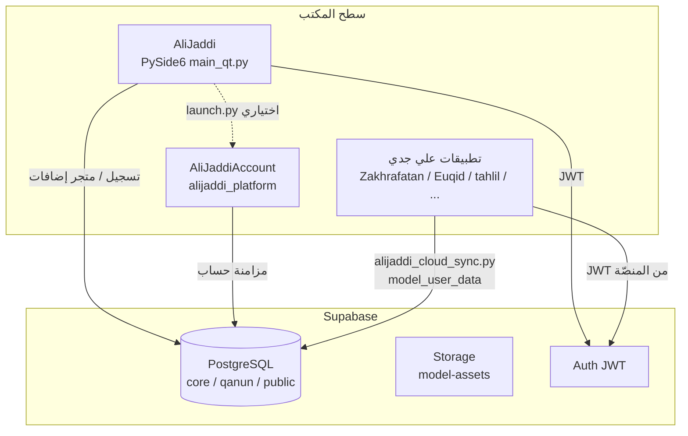

# معمارية منصّة علي جدّي (Beta 0.2)

توثيق يربط **المنصّة الرئيسية**، **السحابة**، **حساب المستخدم**، ومشاريع **النماذج** على سطح المكتب.

## مخطط تدفّق عالٍ

## المكوّنات والمسارات

| جزء | المجلد / الملف | الدور |
|-----|-----------------|--------|
| المنصّة | `AliJaddi/` — `main_qt.py`, `ui/`, `services/` | واجهة Qt، متجر النماذج، `addon_manager`، مصادقة |
| السحابة | `AliJaddi Cloud/` — `python/integration/` | أدوات مساعدة، ضغط، REST؛ الهجرات في `AliJaddi/supabase/migrations/` |
| الحساب | `AliJaddiAccount/` — `alijaddi_platform/desktop/launcher.py` | يُستدعى من `AliJaddi/launch.py` عند التشغيل بدون وسيطات |
| نموذج على سطح المكتب | `تطبيقات علي جدي/<Model>/alijaddi_cloud_sync.py` | رفع/جلب `payload` عبر `rest/v1/model_user_data` |

## متغيرات بيئة مشتركة

- `SUPABASE_URL`, `SUPABASE_ANON_KEY` — نفس المشروع لجميع العملاء (انظر `.env.example`).
- JWT المستخدم يُمرَّر أحياناً كـ `ALIJADDI_JWT` من المنصّة عند تشغيل نموذج خارجي.

## بناء التوزيع (Windows)

- `scripts/build_windows_release.ps1` — PyInstaller + PySide6.
- الحزمة: `تنزيل/windows/AliJaddi-Beta-0.2-Windows.zip` (مستثناة من Git).

---

© 2026 AliJaddi — بيتا 0.2
